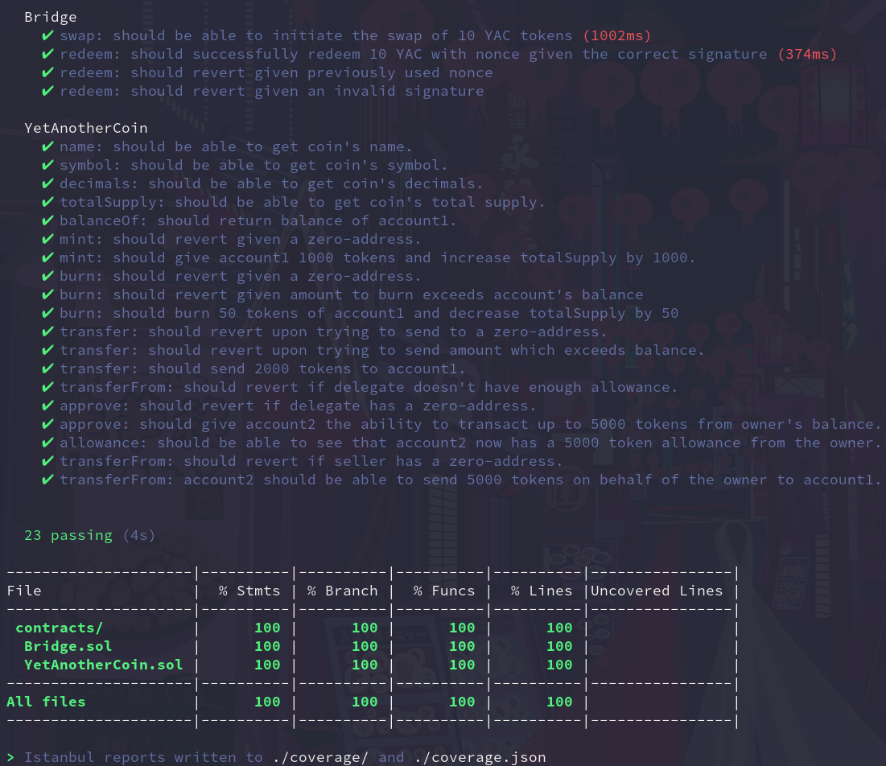
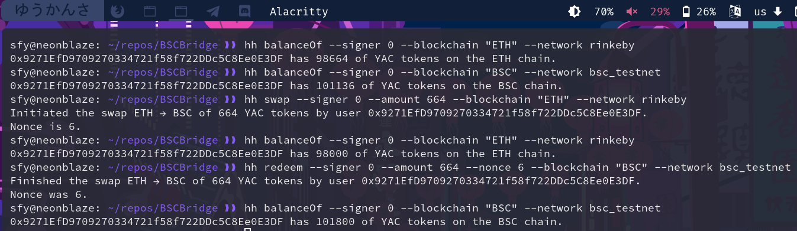

# BNBT-Rinkeby ERC20 Token Bridge 🌉

A BNBT-Rinkeby blockchain bridge implementation for a sample ERC20 token. 

## Features

- [x] Uses ECDSA for signature verification in redeem().
- [x] All contracts are deployed to BNBT and Ethereum (Rinkeby) testnets and verified on Etherscan/BscScan:
  - [BNBT Bridge](https://testnet.bscscan.com/address/0x2c6Faf8BFF8aBc51d7dffA2a5F7B364B984d54A9#code): @0x2c6Faf8BFF8aBc51d7dffA2a5F7B364B984d54A9
  - [Rinkeby Bridge](https://rinkeby.etherscan.io/address/0x899BA9750fB97097C7163781C9672Dd9ed9CCA85#code): @0x899BA9750fB97097C7163781C9672Dd9ed9CCA85
  - [YAC token (BNBT)](https://testnet.bscscan.com/address/0xf55aBB498A19Fe90B039BC30aAD11C2e9f71bab1#code): @0xf55aBB498A19Fe90B039BC30aAD11C2e9f71bab1
  - [YAC token (Rinkeby)](https://rinkeby.etherscan.io/address/0xB069A157Ed653d91765eA1E8bAc5c18454A83Ba4#code): @0xB069A157Ed653d91765eA1E8bAc5c18454A83Ba4
- [x] Tests provide a 100% coverage in accordance with _solidity-coverage_.
- [x] Tasks for swap(), redeem(), and to fetch YAC token balances on each chain.
- [x] Contracts are 100% covered with NatSpec.
- [x] A comprehensive Markdown documentation is available in _docs/_.

## To do

- [x] Use EIP712-compliant signing.
- [ ] Use token pools instead of burn() and mint().
- [x] Take commissions for swaps.
- [x] Add sender and recipient.

## Usage

**IMPORTANT: all variable data needed to deploy/use/test the contract is stored in config.ts**

```
cat config.ts
const config = {
  BRIDGE_BNBT_ADDRESS: "0x2c6Faf8BFF8aBc51d7dffA2a5F7B364B984d54A9",
  BRIDGE_RINKEBY_ADDRESS: "0x899BA9750fB97097C7163781C9672Dd9ed9CCA85",
  YAC_BNBT_ADDRESS: "0xf55aBB498A19Fe90B039BC30aAD11C2e9f71bab1",
  YAC_RINKEBY_ADDRESS: "0xB069A157Ed653d91765eA1E8bAc5c18454A83Ba4"
};

export default config;
```

0. Make sure that you have enough YAC tokens on the appropriate network using the _balanceOf_ task.
For better comprehension, here the swap will be from BNBT to Rinkeby (an order reversed compared to the one presented on the demo screenshot).

```
hh balanceOf --signer 0 --network bnbt
0x9271EfD9709270334721f58f722DDc5C8Ee0E3DF has 102000 of YAC tokens on the BNBT chain.
```

Also check the Rinkeby balance so you can see the result in the end more clearly.

```
hh balanceOf --signer 0 --network rinkeby
0x9271EfD9709270334721f58f722DDc5C8Ee0E3DF has 97800 of YAC tokens on the RINKEBY chain.
```

1. Initiate the swap using the _swap_ task.

```
hh swap --signer 0 --recepient "0x9271EfD9709270334721f58f722DDc5C8Ee0E3DF" --amount 2000 --network bnbt
Initiated the swap from BNBT of 2000 YAC tokens by user 0x9271EfD9709270334721f58f722DDc5C8Ee0E3DF to user 0x9271EfD9709270334721f58f722DDc5C8Ee0E3DF.
Nonce is 0.
```

As we can see, our BNBT YAC balance decreased by 2000.

```
hh balanceOf --signer 0 --network bnbt
0x9271EfD9709270334721f58f722DDc5C8Ee0E3DF has 100000 of YAC tokens on the BNBT chain.
```

2. Redeem the swapped assets using the _redeem_ task.
Make sure all the values (including the nonce) are correct, for otherwise signature check will fail.

```
hh redeem --signer 0 --sender "0x9271EfD9709270334721f58f722DDc5C8Ee0E3DF" --amount 2000 --nonce 0  --network rinkeby
Finished the swap to RINKEBY of 2000 YAC tokens by user 0x9271EfD9709270334721f58f722DDc5C8Ee0E3DF to user 0x9271EfD9709270334721f58f722DDc5C8Ee0E3DF.
Nonce was 0.
```

Now we check our Rinkeby YAC balance — it increased by 2000 as expected.
Hooray!

```
hh balanceOf --signer 0 --network rinkeby
0x9271EfD9709270334721f58f722DDc5C8Ee0E3DF has 99800 of YAC tokens on the RINKEBY chain.
```

Repeat as many times as you'd like to :)

P.S. _hh_ is an alias for _npx hardhat_.

## Demonstation




