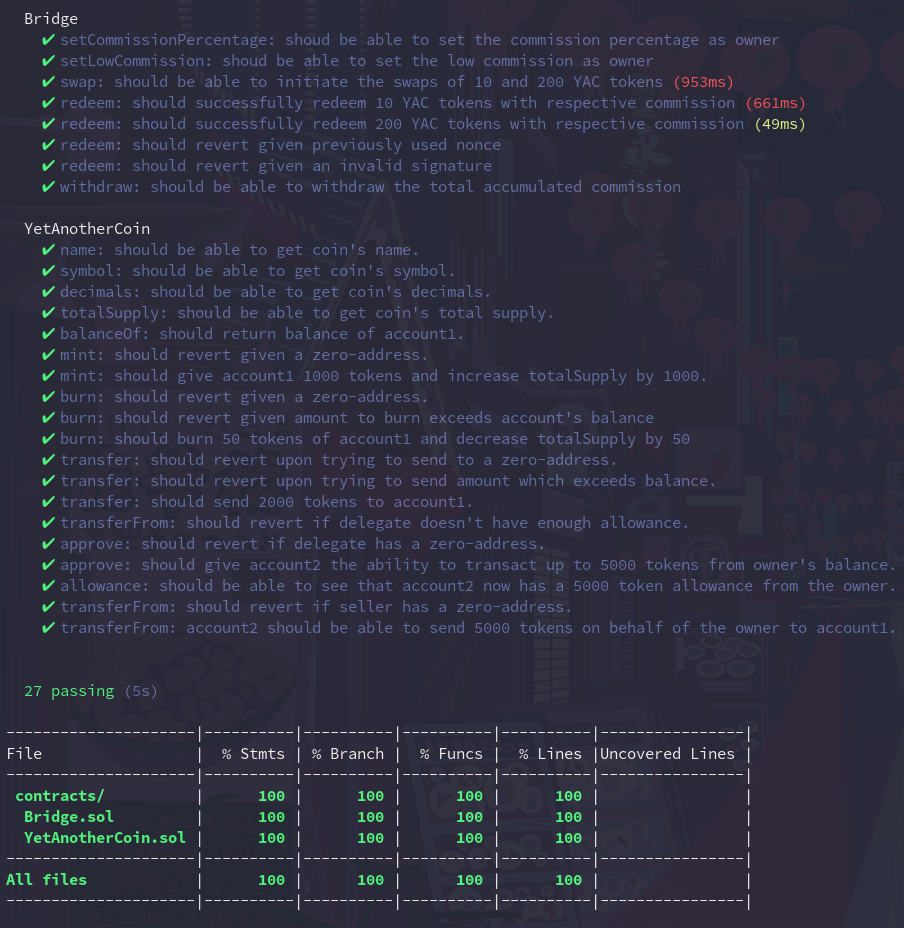

# Rinkeby-BNBT ERC20 Token Bridge 🌉

A BNBT-Rinkeby blockchain bridge implementation for a sample ERC20 token. 

## Features

- [x] Uses ECDSA for signature verification in redeem().
- [x] All contracts are deployed to BNBT and Ethereum (Rinkeby) testnets and verified on Etherscan/BscScan:
  - [BNBT Bridge](https://testnet.bscscan.com/address/0xF4Fd87c6bACf11984152e59F04451d063ce348ab#code): @0xF4Fd87c6bACf11984152e59F04451d063ce348ab
  - [Rinkeby Bridge](https://rinkeby.etherscan.io/address/0x03Bf536B5D8ec4D324E71F4775f690988D48180d#code): @0x03Bf536B5D8ec4D324E71F4775f690988D48180d
  - [YAC token (BNBT)](https://testnet.bscscan.com/address/0xf55aBB498A19Fe90B039BC30aAD11C2e9f71bab1#code): @0xf55aBB498A19Fe90B039BC30aAD11C2e9f71bab1
  - [YAC token (Rinkeby)](https://rinkeby.etherscan.io/address/0xB069A157Ed653d91765eA1E8bAc5c18454A83Ba4#code): @0xB069A157Ed653d91765eA1E8bAc5c18454A83Ba4
- [x] Tests provide a 100% coverage in accordance with _solidity-coverage_.
- [x] Tasks for swap(), redeem(), and to fetch YAC token balances on each chain.
- [x] Contracts are 100% covered with NatSpec.
- [x] A comprehensive Markdown documentation is available in _docs/_.

## Demonstation

